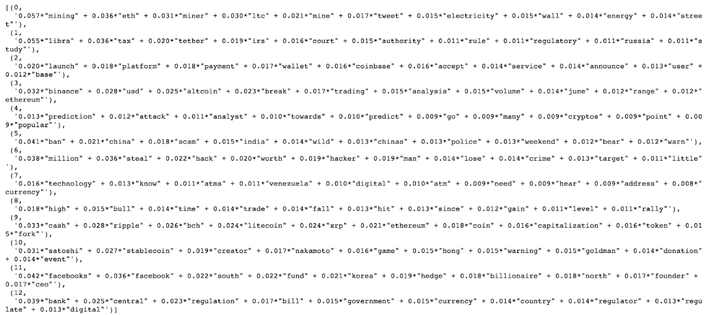
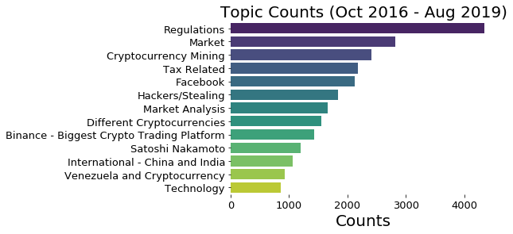
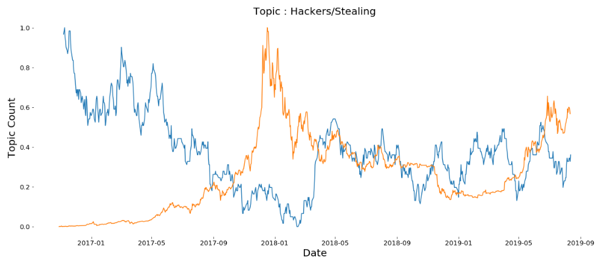
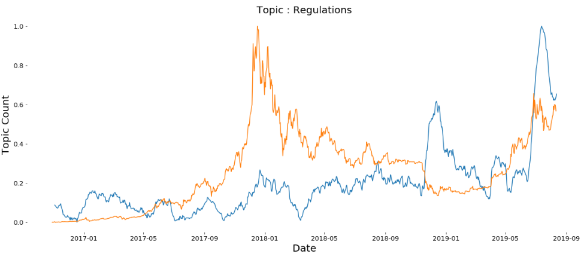
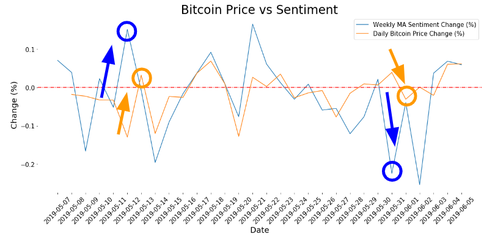
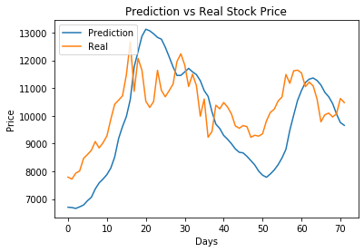

# Bitcoin Topic Modeling/Sentiment Analysis Using NLP and Trading Using LSTM
I applied **natural language processing (NLP)** on news articles to perform **topic modeling** using bag-of-words approach and **sentiment analysis** using open source modules. Topic modeling gives a very concise visual for the user to understand topics and trends revolving around Bitcoin and cryptocurrency over time. Also, features created from sentiment analysis were combined with other features (Bitcoin's open price, close price, volume, etc.) to build a **LSTM model to predict Bitcoin price**.

## Project Intro/Objective
I specifically chose Bitcoin over traditional stocks to apply NLP because Bitcoin only has two analysis components (technical and sentimental) and is missing the fundamental, which traditional stocks all have. This is good since it means that sentimental analysis has greater power of affecting Bitcoin price. However, the difficulty of sentimental analysis has always been limited by human factors. There are 3.2 million online articles and 500 million tweets **daily**, and it is **impossible** for humans to process this much information. Using state-of-the-art machine learning algorithms, it has become possible to not only process this much information but also use it as features for prediction models to provide highly advanced guidances.

Refer to presentations for more lighter intro to my project  
* [Presentation Link - Google Slides](https://docs.google.com/presentation/d/1v__ZPV--fQRT2HkwEQG_ULtZ8vP9zDoMuestRkisUOg/edit?usp=sharing)  
* [Presentation Link - Hard Copy](https://github.com/silvernine209/bitcoin_trader/raw/master/presentation.pptx)

## Datasets Used
* News articles' headlines and intros were scraped across 1500+ publishers for over 3 years time span.

## Methods Used
* Web Scraping
* Exploratory Data Analysis (EDA)
* Natural Language Processing(NLP)
* Topic Modeling
* Sentiment Analysis
* Feature Engineering
* Data Visualization
* Predictive Modeling (NN and LSTM)

## Notable Technologies Used
* Python 3, Jupyter Notebook
* Nltk, Gensim, Spacy, Scikit-learn # NLP Text Processing
* CountVectorizer, TfidfVectorizer, NMF, LDA, CorEx # Topic Modeling
* TextBlob, vaderSentiment # Sentiment Analysis
* Pandas, Numpy, Matplotlib, Seaborn # Data Processing/Visualization tools
* Neural Network, LSTM, Scikit-learn # Models
* etc. 

## Feature Engineering
Various preprocessing techniques were applied on the text corpus of article headlines and intros. Preprocessing of texts is crucial for the meaningful performance of clustering algorithms in topic modeling realm. This preprocessed texts were carried over to sentiment analysis as well. Although not implemented in my predictive models, topic vectors from the **Latent Dirichlet Allocation (LDA)** model for topic modeling were extracted to be used as input features to predictive models if deemed necessary. Besides the realm of NLP, various technical aspects of Bitcoin(prices, volumnes, etc.) were feature engineered for predictive models' inputs.

* **Text Preprocessing** - Removal of punctuations, numbers, special characters, and stopwords. Lowercasing, lemmatization as well.
* **LDA's Topic Vectors** - Input for predictive models.
* **Sentiments** - Combination of TextBlob, vaderSentiment were used to create one feature for sentiment
* **Moving Averages** - Various increments of MAs for prices, volumes, and sentiments
* **Rate of Change in Percent** - Instead of daily values of the metrics only, daily percent changes were calcualted to generate features to generalize

## Model 
### Topic Modeling
Various combinations of techniques and hyperparameters were tried. Ultimately, **Frequency-inverse Document Frequency (Tf-idf)** was used for bag-of-word algorithm to capture terms appearing infrequently. Then, **Latent Dirichlet Allocation (LDA)** was used for clustering algorithm to form the topics. Besides the fact that LDA resulted in better topic clusters, LDA also produces topic vectors that's manageable in terms of number of vectors (same as number of generated topics) that could be fed into predictive models. Some of other combinations used were **CountVectorizer**, **Non-negative Matrix Factorization (NMF)**, and **Correlation Explanation (CorEX)**. 
Below is an image of 13 topics and most dominant words picked up by Tf-idf & LDA models.  

Then, I assigned appropriate topic names for each cluster and plotted by frequency in descending order.  

Below are examples of trends of topics over time. As Bitcoin matured, wild west era of hacking and stealing Bitcoin decreased while regulations kept increasing. Orange line represents Bitcoin price and blue line represents corresponding topic's occurence. Both are rescaled to overlap in the same graph.   

### Sentiment Analysis
For sentiment analysis, I implemented two most popular modules : TextBlob and vaderSentiment. Two modules agreed on majority of sentiments, but resulted in completely opposite sentiments for certain data. In order to smooth out the effect of sentiment feature's impact on the predictive model, averaging of the two different modules yielded best result. Then, I verified if sentiment could be used as a precursor for the price fluctuations, or in another word a meaningful feature for the predictive modeling. Below is an image confirming the cases when there was a directional change in sentiments, marked with blue arrow and circle, that happens before directional change in price, marked as Orange arrow and circle.  

### Predictive Modeling
I built both simple neural network and LSTM models for predictive modeling of Bitcoin price. As suspected, LSTM performed far superior over simple neural net since dataset is time sentisive. LSTM model was trained to use previous 8 days worth of data to predict next day's Bitcoin price. Features used for the model is described in "Feature Engineering" section. LDA model's topic features were not used as they did not excert any meaningful impact on the model. Careful train/validation/test set split was carried out so that the model doesn't look into the future (important especially since moving averages were used). Here is LSTM model's performance on price prediction.  

## Result 
Even though LSTM model's prediction looks pretty good on the surface, it actually is not. Simply put, it probably has learned to predict a value close to the previous days' price. At current state, it is only predicting the next day's price. However, if similar result as image above was achieved with predicting not just one day but several days ahead of the time, I could then call it a big success. 

## Conclusion
This was a very meaningful and successful project for me. I was able to build an entire pipeline that utilizes the power of NLP and include features generated from NLP (topic vectors and sentiment features) into predictive modeling. Also, this pipeline can apply to **ANY** traded commodities/stocks/cryptocurrencies. Also, this project will be used as a backbone for my follow-up project that will focus more on actual trading of Bitcoin. In this follow-up project, I will interact with paper trading API to back test different strategies/models and potentially implement it in real trading. 

## [Link to Blog](https://silvernine209.github.io/matthewlee.github.io/)
